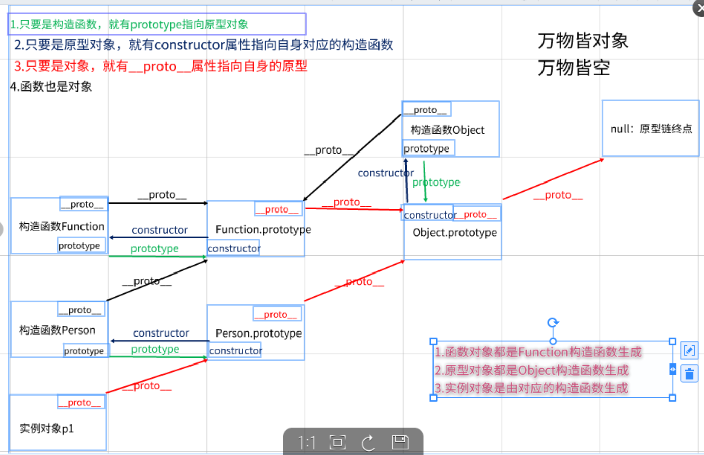

## JS相关

### 1. 数组转成字符串的方式

1. 使用toString方法 转成字符串

例如 var arr = [1,2,3]

arr.toString() ==  '1,2,3';

2. 使用join()方法 转成字符串

例如 var arr = [1,2,3]

arr.join(',') ==  '1,2,3';
还可以自由控制需要什么隔开例如 - , 如果不需要什么隔开就写空
arr.join('') ==  '123';

### 2. JS数组的排序方式

1. 使用数组的sort函数可以实现排序

但是默认sort是按照ASCII编码排序的
如果需要按照数值的从小到大 从大到小需要使用第二个参数 是一个回调函数 回调函数需要两个参数 用来说明你要按照什么方式排序

例如a,b  
如果 a - b < 0 表示 a 比 b小 那么真实的a代表的数字就会排在b前面    
如果 a - b == 0 那么表示2个值相等 就按顺序排序
如果 a - b > 0 表示 a比b大 那么真实a代表的数组就会排在b后面

```js

function sortNumber(a, b) {
           
    return a - b  // 从小到大
    // return b - a  // 从大到小
}

var arr = [10, 5, 40, 25, 1000, 1]

document.write(arr + "<br />")
document.write(arr.sort(sortNumber));// 1 5 10 25 40 1000 从小到大
```

2. 自己使用算法实现排序 例如 冒泡排序

```js
var arr = [10, 20, 1, 2];
var t;
for(var i=0;i<arr.length;i++){
    for(j=i+1;j<arr.length;j++){
        if(arr[i]>arr[j]){
            t=arr[i];
            arr[i]=arr[j];
            arr[j]=t;
        }
    }
}
console.log(arr);  //[1, 2, 10, 20]
```

3. 快速排序

```js
// 快速排序
var quickSort = function(arr) {
    if(arr.length < 1) {//如果数组就是一项，那么可以直接返回
        return arr;
    }
    var centerIndex = Math.floor(arr.length / 2);//获取数组中间的索引
    var centerValue = arr[centerIndex];//获取数组中间项
    var left = [], right = [];
    for(var i = 0; i < arr.lenght; i++){
        if(arr[i] < centerValue){
            left.push(arr[i]);
        }else{
            right.push(arr[i]);
        }
    }
    return quickSort(left).contanct([centerValue], quickSort(right));//递归调用
}
```

### 3. JSON转换

1. 将JS对象转成JSON字符串
var str = JSON.stringify(obj);

2. 将JSON字符串转成JS对象

var obj = JSON.parse(str); 


### 4. 对原型链的理解

1. 什么是原型链
    简单来说就是对象和构造函数之间连接的一个链条 简称原型链
2. 原型链的作用
    可以通过原型链继承构造函数对象定义的一些公共的属性方法
3. 原型链的流程图

    

### 5. JS变量提升和自执行函数的面试题

```js
(function(){
    console.log(a);// undefined 虽然此时在函数内打印有a 因为var变量声明会提前所以不会报错 但是赋值不会提前所以a没有值是 undefined
    var a = b = 1;        
})();        
console.log(b);//1 因为 var a = b = 1 其实b并没在里面var所以 b是全局变量并且赋值为了1所以是1
console.log(a);// 因为 var a = b = 1; 这个var是在自执行函数里面的自执行函数是一个函数作用域 所以var a是函数内的局部变量所以外界拿不到 即是报错  a is not defined
```

### 6. JS this指向的面试题

```js

var name = '王五';
var obj = {
    name: '张三',
    getName:function(){
        return this.name;
    },
    children:{
        name:'李四',
        getName:function(){
            return this.name;
        }
    }
}    
console.log(obj.getName());//张三
console.log(obj.children.getName());//李四
var getName = obj.children.getName;
console.log(getName());//王五
// 那么如果我想调用getName() 但是想打印张三怎么办 可以使用call函数改变调用当前函数的this指针
console.log(getName.call(obj));//张三
```

### 7. 使用JS的类实现一个栈的类 并实现栈里面的常用API

```js
// 定义一个栈的类 实现栈的push pop getMax getMin等函数 
// 并实现先进后出 后进先出 而且能够不断求出 当前栈里面的数据的最大值最小值
class Stack {
    constructor(){
        this.dataStack = [];
        this.maxStack = [];
        this.minStack = [];

    }
    // 入栈
    push(item){
        if(this.minStack.length <= 0){
            this.minStack.push(item)
        }
        else if(item <= this.getMin()){
            this.minStack.push(item)
        }

        if(this.maxStack.length <= 0){
            this.maxStack.push(item)
        }
        else if(item >= this.getMax()){
            this.maxStack.push(item)
        }
        this.dataStack.push(item);                
    }
    // 出栈
    pop(){
        if(this.dataStack.length <= 0){
            return 
        }
        let value = this.dataStack.pop();
        
        if(value == this.getMin()){
            this.minStack.pop()
        }
        if(value == this.getMax()){
            this.maxStack.pop();
        }
        return value;
    }
    // 求最小值
    getMin(){               
        if(this.minStack.length <=0){
            return 0;
        }
        return this.minStack[this.minStack.length-1];
    }
    // 求最大值
    getMax(){             
        if(this.maxStack.length <=0){
            return 0;
        }                
        return this.maxStack[this.maxStack.length-1];
    }
}    
// 创建栈的对象
var stack = new Stack();
// 调用入栈
stack.push(3);
stack.push(5);
stack.push(10);
stack.push(7);
stack.push(6);
// 调用求最大值 最小值的函数
console.log(stack.dataStack);       
console.log(stack.getMax());
console.log(stack.getMin());
// 出栈
stack.pop();
stack.pop();
// 出栈后的最大值最小值
console.log(stack.getMax());
console.log(stack.getMin());
console.log(stack.minStack);
console.log(stack.maxStack);
stack.pop();
console.log(stack.getMax());
console.log(stack.getMin());
console.log(stack.minStack);
console.log(stack.maxStack);
stack.pop();
console.log(stack.getMax());
console.log(stack.getMin());
console.log(stack.dataStack);
console.log(stack.maxStack);
stack.pop();
console.log(stack.getMax());
console.log(stack.getMin());
console.log(stack.dataStack);
console.log(stack.maxStack);
```